# 기본 설정
## 프로필 설정
가장 먼저 gitlab의 오른쪽 위에 있는 프로필을 누르시고 프로필을 설정해 주시면 좋습니다.  
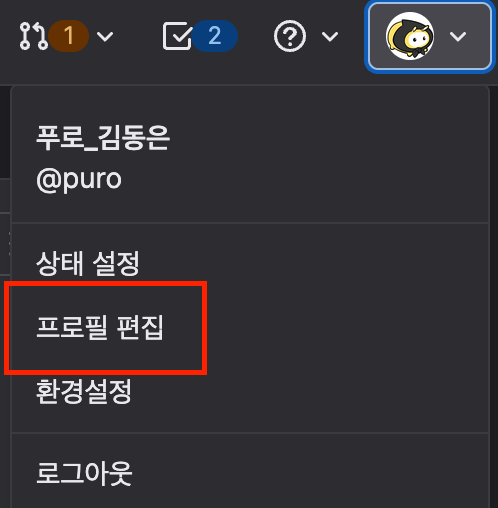

이슈나 머지 리퀘스트 목록에서 작성자를 확인하기 쉬워집니다.  
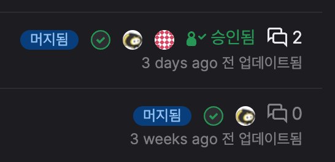

## 언어 및 테마 설정
프로필 편집 버튼 아래에 있는 환경 설정에서 편의를 위한 설정을 변경하실 수 있습니다.  
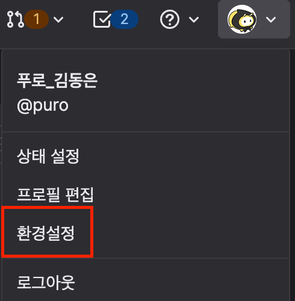  
깃랩의 하얀색 배경으로 인해 눈이 아프시다면 색상 테마를 변경해 주세요.

아래의 항목 중에 언어를 변경하실 수 있는 항목도 있습니다.  
gitlab의 버전 문제로 주요 메뉴만 번역이 되어있는 상태이지만 추후 본사 측에서 온프레미스 gitlab 버전이 업데이트 해주신다면 좀 더 완전한 한글화가 되어있을 것으로 예상됩니다.

## git clone
클론 방식은 GitHub와 동일합니다.
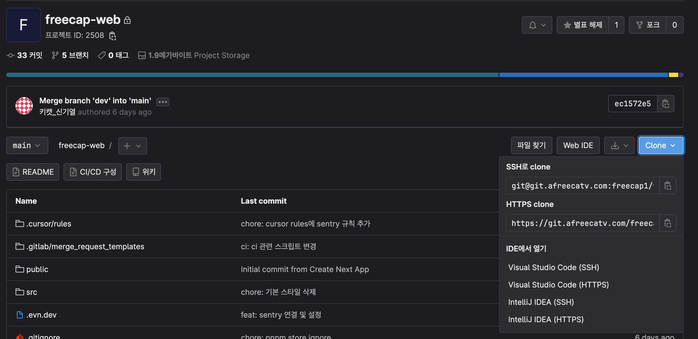

## 이슈 생성
현재는 아래와 같은 이슈 라벨들이 생성되어 있는 상태입니다.  
(라벨이 없다면 @puro 에게 문의해 주세요.)
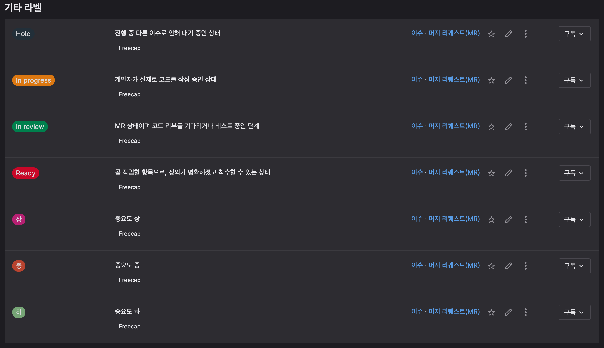  

작업을 진행해야 한다면 이슈 탭을 클릭하시고 New issue로 이슈를 생성합니다.
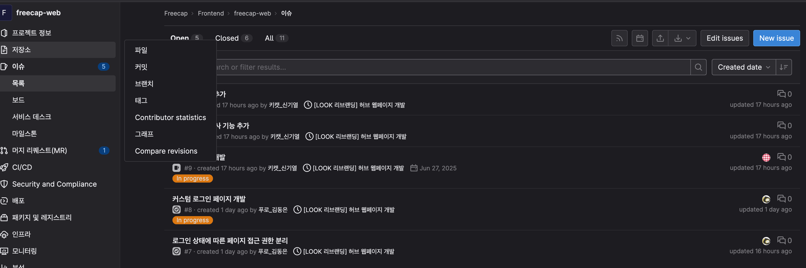  
1. 이슈의 제목에는 개발해야 하는 큰 기능을 작성합니다.(예: 구글 소셜 로그인 기능 개발)
2. 단순 이슈라면 Type은 issue 사건이라면 incident를 선택합니다.
3. 이슈 설명에는 issue 타입이라면 어떤 기능을 개발하는지, incident 타입이라면 원인을 설명합니다.
4. 담당자 할당, 마감일 지정, 마일스톤 선택을 진행하고 이슈의 현재 상태에 맞는 라벨을 지정합니다.
5. 이슈를 생성합니다.

규모가 작은 이슈는 이슈 설명에 구현해야 하는 기능을 모두 적습니다.
규모가 큰 이슈라면 이슈의 Tasks에 추가적으로 Add하여 따로 관리합니다.  
(Task 마다 상태 라벨을 따로 관리해야 합니다.)  
  
생성하신 이슈는 이슈 라벨에 따라 이슈 보드에서 확인해 보실 수 있습니다.  
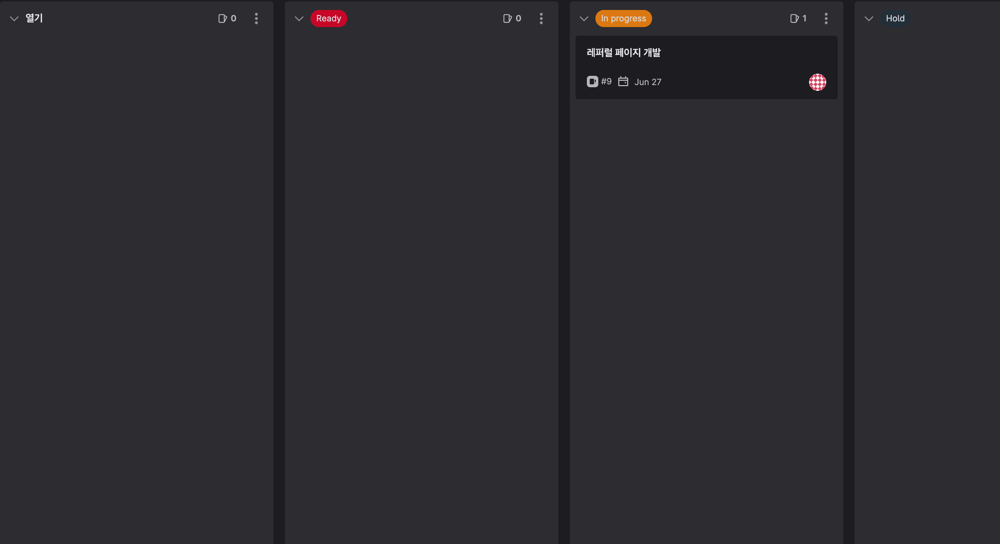

## Merge Request
Merge가 필요하다면 gitlab에서 머지 리퀘스트(MR)을 생성해 주세요.  
소스 브랜치와 대상 브랜치는 항상 꼼꼼하게 확인해 주세요. 
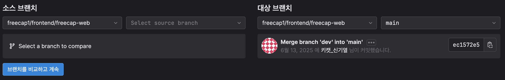

Title에는 구현한 기능을 한 문장으로 정리해 주세요.  
당장 머지가 되면 안되는 MR이라면 Mark as draft를 체크해 주세요.  
추후 생성된 MR에서 Mark as ready로 MR이 가능한 상태로 변경할 수 있습니다.  
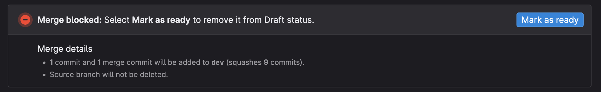  

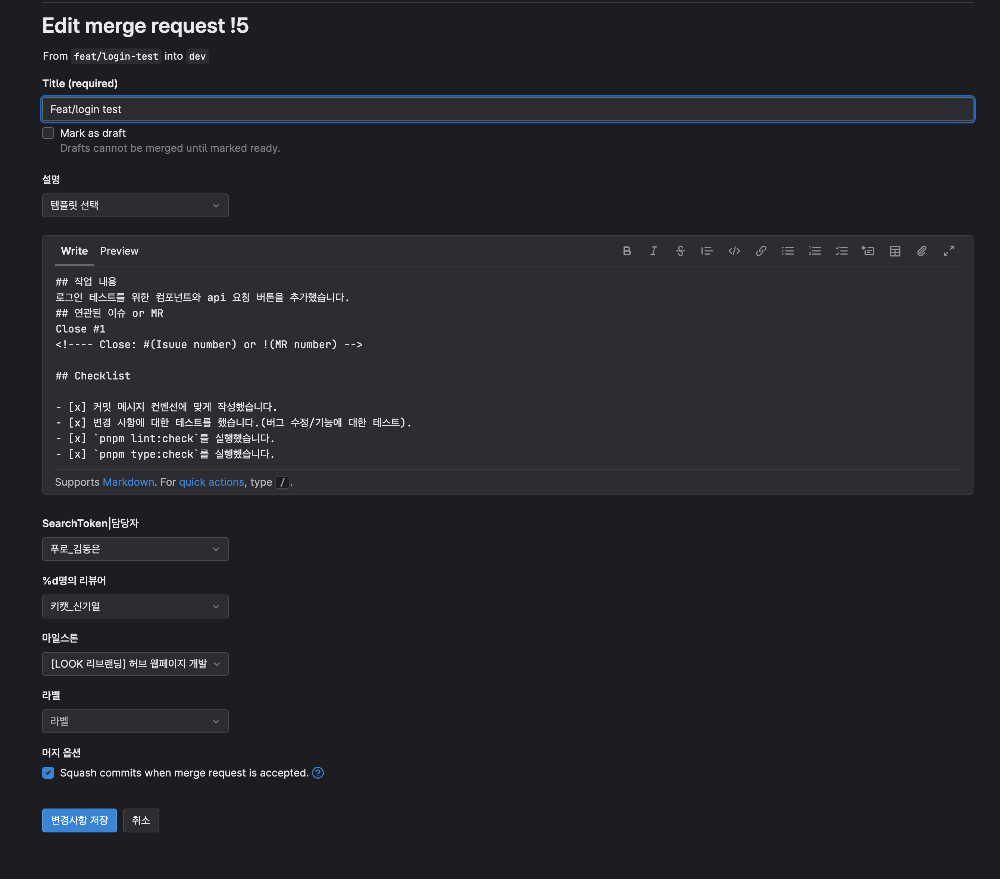  
기본적으로 설정되어 있는 MR 템플릿을 바탕으로 설명을 작성해 주세요.

이슈에 대한 언급은 '#' 다른 MR에 대한 언급은 '!' 유저에 대한 언급은 '@'를 사용하시면 됩니다.  
'Close #1' 처럼 이슈를 언급하시면 MR이 머지되었을 때 자동으로 이슈가 Close 됩니다.(이 부분은 프로젝트 설정에서 켜져 있어야 합니다.)[안내 링크](https://git.afreecatv.com/help/user/project/issues/managing_issues.md#closing-issues-automatically)  

기본 템플릿에 체크리스트에 있는 체크리스트를 모두 통과하는지 체크해 주세요.  
(체크리스트를 통과한다면 MR 생성 이후 체크리스트를 클릭하여 체크해 주시면 됩니다.)

이후 담당자와 리뷰어를 지정해 주세요.  
머지 옵션은 Squash 머지를 사용하도록 체크해 주세요.(많은 수의 커밋 기록을 단순화하기 위함입니다.)  
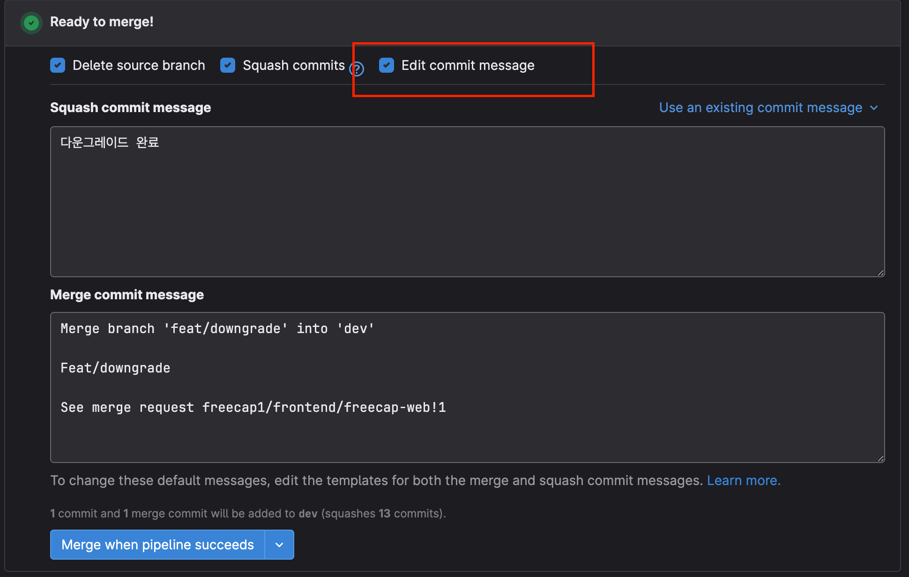  
squash 머지를 진행할 때의 커밋 메시지는 생성된 MR에서 변경이 가능합니다.

이후 MR을 생성하시고 체크리스트에 체크를 진행해 주세요.(이 체크도 로그에 기록됩니다.)  
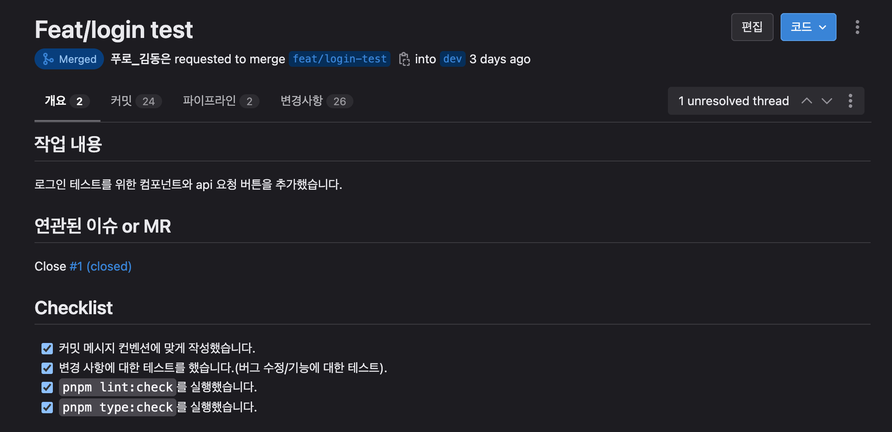  

MR이 생성되거나 MR에 새로운 커밋이 push 된다면 머지 리퀘스트 파이프라인이 작동합니다.  
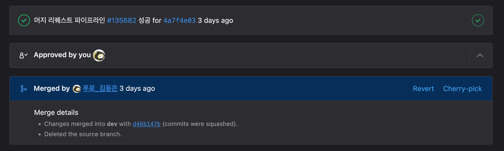

파이프라인에서 어떤 작업이 진행되는지에 대한 부분은 [링크](MR 파이프라인)를 참조해 주세요.  
파이프라인의 테스트를 모두 통과한다면 MR이 머지 가능 상태가 됩니다.

코멘트에서 '@'를 사용해 리뷰어에게 리뷰를 요청해 보세요.  
예: @puro MR 리뷰 부탁드립니다.  
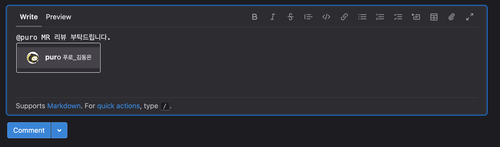  

리뷰어는 MR의 변경 사항에서 코멘트를 작성할 수 있습니다.  
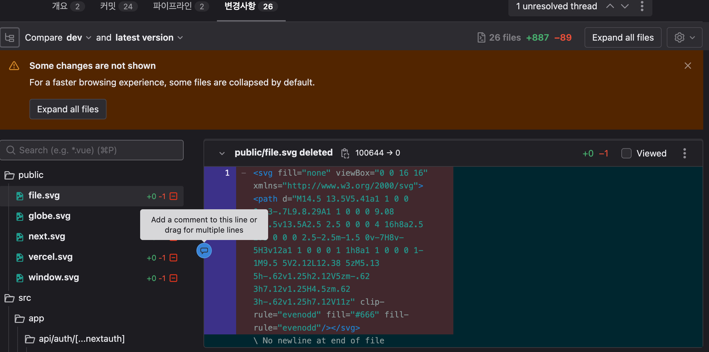  
작성하신 코멘트는 MR 개요에서 확인하실 수 있습니다.  
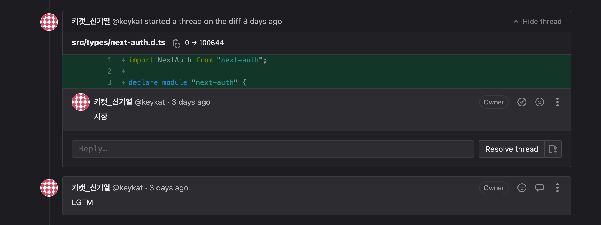  
MR에 문제가 없다면 리뷰어는 코멘트를 남기고 MR을 승인해 주세요.
