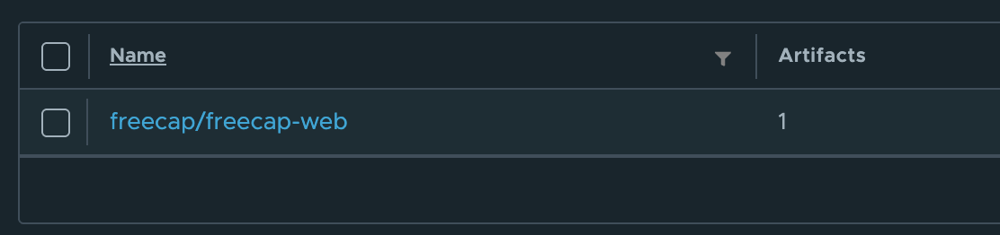
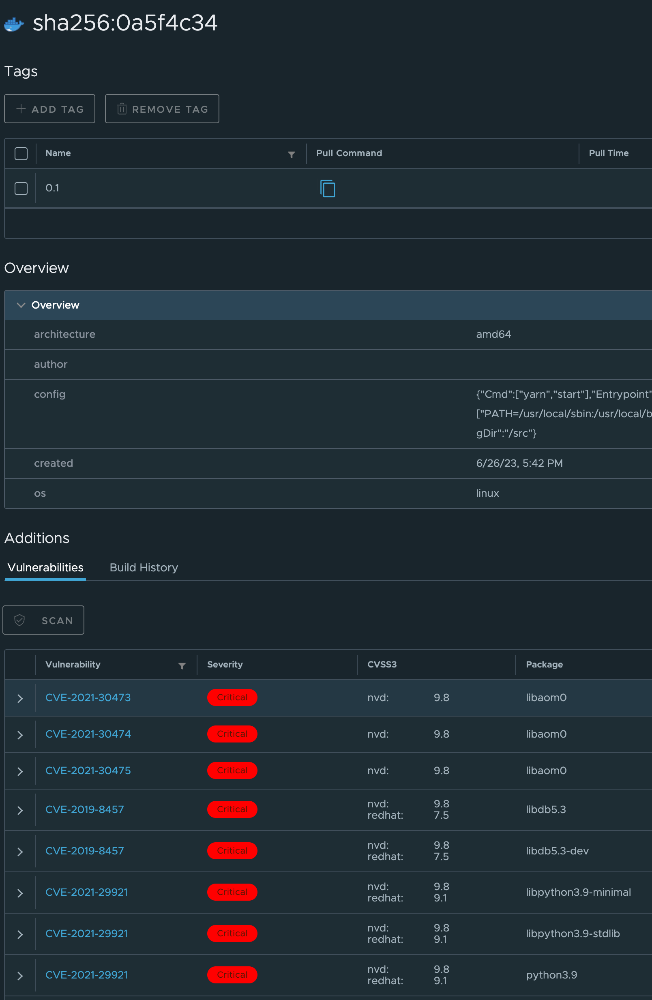
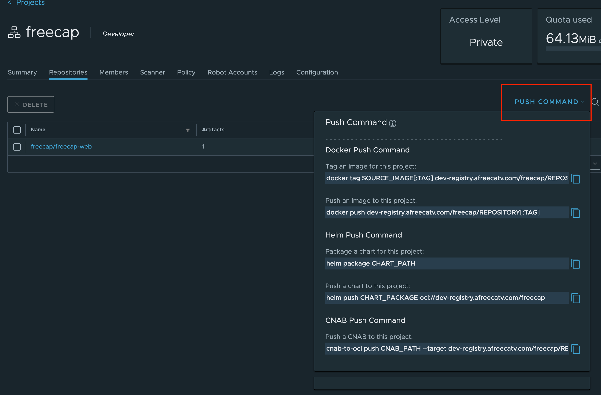

harbor 접속을 위해서는 hosts 설정이 필요합니다.
``` text
# harbor
211.49.227.176	docker-registry.afreecatv.com # https://docker-registry.afreecatv.com
58.229.162.194	dev-registry.afreecatv.com	notary-dev-registry.afreecatv.com
```

hosts 설정을 마치셨다면 링크로 접속이 가능합니다.  
[main-harbor](https://docker-registry.afreecatv.com/)  
[dev-harbor](https://dev-registry.afreecatv.com/)  
(계정이 없다면 시스템팀에 문의 후 생성 필요)

harbor의 로그인은 ad 계정으로 진행합니다. 프리캡 서비스개발팀의 개발자는 `freecap`이라는 프로젝트의 Developer로 등록되어 있습니다.

freecap 프로젝트 내부에서도 레포지토리를 나눌 수 있습니다.  


레포지토리를 클릭하시면 이미지를 보실 수 있고 이미지를 클릭하시면 상세 정보 확인이 가능합니다.  

harbor에서는 레포지토리에 저장된 이미지에 대한 보안 취약점 분석이 가능합니다.  


추가적인 기능들이 있지만 아직은 사용하지 않습니다.

## push
harbor에 push 하려면 로그인이 필요합니다.
``` zsh
docker login dev-registry.afreecatv.com
// ad 계정 입력
```

push에 대한 커멘드는 우측 상단에 버튼에서 확인하실 수 있습니다.  

수동으로 push를 진행하신다면 태그를 지정하고 push 해주시면 됩니다.