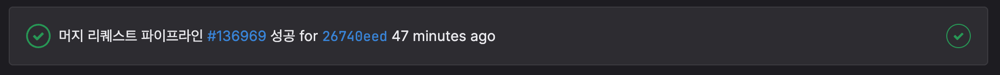

MR이 생성되거나 MR에 새로운 커밋이 push 된다면 MR 파이프라인이 작동합니다.  
이 파이프라인이 성공적으로 진행되어야만 오류가 없는 MR이라고 판단되어 머지가 가능해집니다.  


MR 파이프라인에서 진행되는 내용은 프로젝트 코드베이스 루트의 `.gitlab-ci.yml` 파일에 정의되어 있습니다.  
``` yml
stages:
  - test

biome_check:
  stage: test
  image: node:20-alpine
  before_script:
    - npm install --global corepack@latest
    - corepack enable
    - corepack prepare pnpm@10.12.1 --activate
    - pnpm config set store-dir .pnpm-store
  script:
    - pnpm install --frozen-lockfile
    - pnpm biome check .
  cache:
    key:
      files:
        - pnpm-lock.yaml
    paths:
      - .pnpm-store
  tags:
    - docker
    - aflxcombuild
  only:
    - merge_requests

type_check:
  stage: test
  image: node:20-alpine
  before_script:
    - npm install --global corepack@latest
    - corepack enable
    - corepack prepare pnpm@10.12.1 --activate
    - pnpm config set store-dir .pnpm-store
  script:
    - pnpm install --frozen-lockfile
    - pnpm tsc --noEmit
  cache:
    key:
      files:
        - pnpm-lock.yaml
    paths:
      - .pnpm-store
  tags:
    - docker
    - aflxcombuild
  only:
    - merge_requests
```

MR 파이프라인에서 검사하는 부분은 3가지 입니다.
1. 코드에 타입스크립트 에러가 없는지 (pnpm type:check)
2. 코드에 린트 관련 에러가 없는지 (pnpm lint:check)
3. 코드에 포메팅 관련 에러가 없는지 (pnpm format:check)
(옆에 적힌 명령어로 로컬에서 테스트가 가능합니다.)