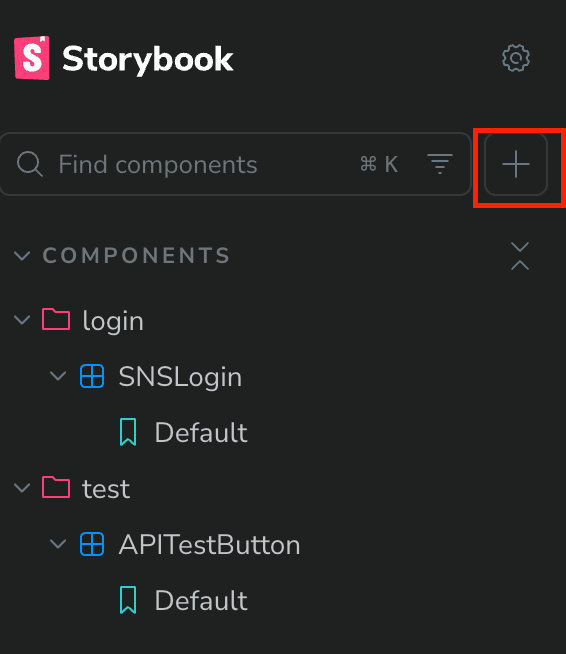
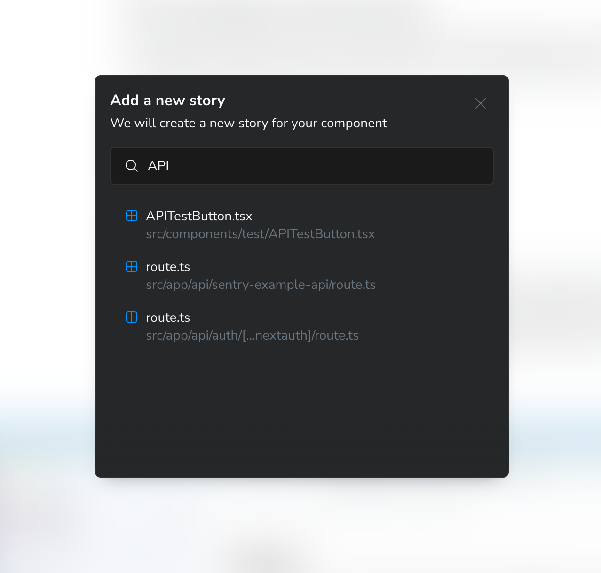
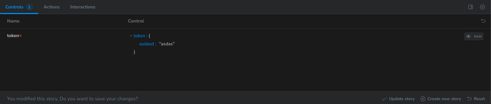
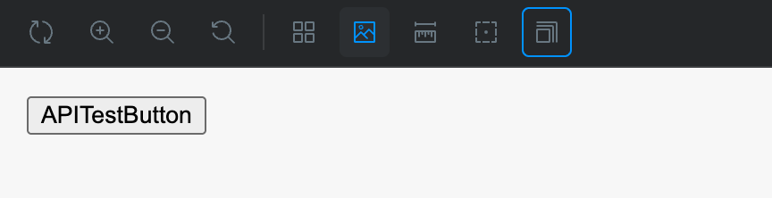

컴포넌트의 UI나 간단한 기능에 대한 테스트는 Storybook에서 진행합니다.

Storybook Docs의 [get-started 페이지](https://storybook.js.org/docs/get-started/why-storybook)에는 storybook에 대한 내용들이 잘 설명되어 있습니다.
> Every piece of UI is now a component. The superpower of components is that you don't need to spin up the whole app just to see how they render. You can render a specific variation in isolation by passing in props, mocking data, or faking events.

> 스토리북은 UI 구성 요소와 그 스토리를 담은 인터랙티브 디렉터리입니다. 과거에는 앱을 실행하고, 특정 페이지로 이동하고, UI를 적절한 상태로 변형해야 했습니다. 이는 엄청난 시간 낭비일 뿐만 아니라 프런트엔드 개발에도 지장을 줍니다. 스토리북을 사용하면 이러한 모든 단계를 건너뛰고 바로 특정 상태의 UI 구성 요소 작업으로 넘어갈 수 있습니다.

현재 상태에서는 stories 파일은 원본 컴포넌트 파일과 같은 위치에 작성합니다. 직접 stories 파일을 작성하셔도 되지만 storybook의 ui를 이용하셔도 됩니다.
* Cursor 채팅에서 '@'를 입력하시면 Cursor Rules에서 storybook.mdc를 넣으실 수 있습니다. 이 Rule과 story를 작성하고 싶으신 컴포넌트를 채팅에 첨부하면 자동으로 팀 내부 규칙에 맞게 story 파일을 생성해줍니다.


먼저 storybook 서버를 실행합니다.
``` zsh
pnpm storybook
```
localhost:6006으로 접속하신 다음 좌측 상단에서 + 버튼을 클릭하여 스토리를 추가합니다.
  
스토리를 작성할 컴포넌트를 검색합니다.
  
클릭하시면 추가가 완료됩니다. 컴포넌트의 설정 값 변경이 필요한 경우에는 하단에서 추가 설정을 진행합니다.  
  
변경 사항 작성 후 save 버튼을 누르시면 임시적으로 반영되고 Update story 버튼을 누르시면 실제 stories 파일에도 반영됩니다.

간단한 추가 기능들은 상단바에 존재합니다.  

