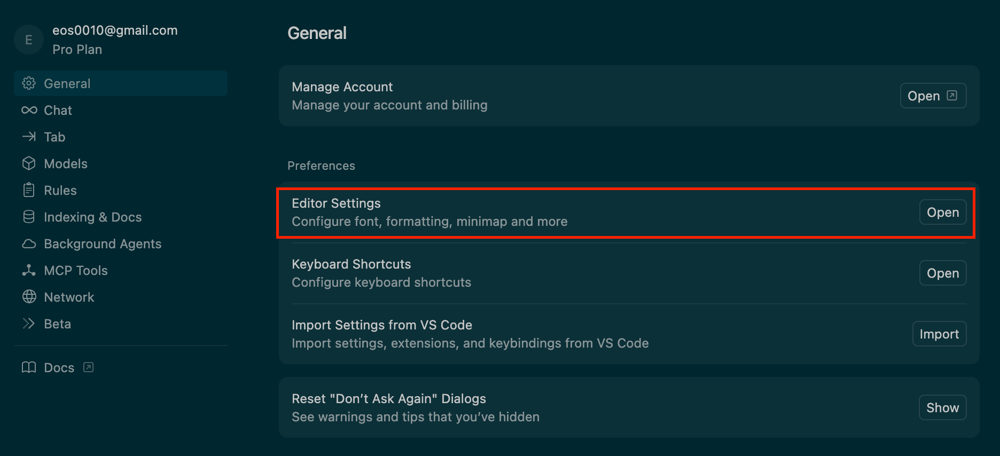

# Biome 설정 방법

1. Biome을 devDependencies로 설치합니다. (패키지 매니저는 pnpm 입니다.)
``` zsh
pnpm add --save-dev --save-exact @biomejs/biome
```
2. Biome init을 실행합니다.
``` zsh
pnpm biome init
```
3. biome.json 파일을 팀 규칙으로 변경합니다.
``` json
{
  "$schema": "https://biomejs.dev/schemas/1.9.4/schema.json",
  "vcs": {
    "enabled": true,
    "clientKind": "git",
    "useIgnoreFile": true
  },
  "files": {
    "ignoreUnknown": true,
    "ignore": []
  },
  "formatter": {
    "enabled": true,
    "formatWithErrors": false,
    "indentStyle": "space",
    "indentWidth": 2,
    "lineEnding": "lf",
    "lineWidth": 320,
    "attributePosition": "auto",
    "useEditorconfig": false
  },
  "organizeImports": {
    "enabled": true
  },
  "linter": {
    "enabled": true,
    "rules": {
      "recommended": true,
      "complexity": {
        "useDateNow": "error",
        "useSimplifiedLogicExpression": "error"
      },
      "correctness": {
        "noConstantMathMinMaxClamp": "error",
        "noUnusedFunctionParameters": "error",
        "useImportExtensions": "error"
      },
      "nursery": {
        "noDocumentCookie": "error",
        "noDuplicateElseIf": "error",
        "noEnum": "error",
        "noHeadElement": "error",
        "noIrregularWhitespace": "error",
        "noNestedTernary": "error",
        "noStaticElementInteractions": "error",
        "useGuardForIn": "error",
        "useTrimStartEnd": "error"
      },
      "style": {
        "useForOf": "error",
        "useImportType": "off"
      },
      "suspicious": {
        "noEvolvingTypes": "error",
        "useAwait": "error"
      }
    }
  },
  "javascript": {
    "formatter": {
      "quoteStyle": "double",
      "jsxQuoteStyle": "double",
      "quoteProperties": "asNeeded"
    }
  }
}
```
4. Cursor에서 Biome 공식 익스텐션을 설치합니다.

5. Cursor의 기본 포매터를 Biome으로 변경합니다.
	1. Cursor 에디터 우측 위 설정 버튼을 누릅니다.

	2. Editor Settings로 이동합니다.
	
	3. 검색창에 format을 검색합니다.
	
	4. Default Formatter를 Biome으로 설정합니다.
	* Format On Save 옵션을 켜면 파일이 저장될 때 포맷팅되어서 편리합니다.