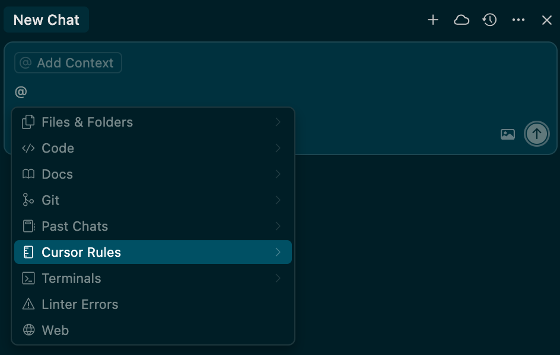
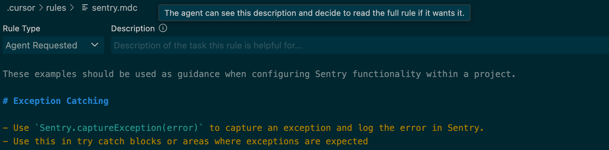

팀 내부에서 cursor를 사용하고 있기 때문에 팀의 공통적인 코드 규칙 같은 부분은 cursor rules로 정의해둘 예정입니다.  
cursor에게 코드 작성에 대한 질문을 한다면 cursor 자체적으로 rule을 포함해서 질문을 할지에 대한 판단을 진행합니다.  

cursor rules를 생성하고 싶으시다면 아래와 같이 '@'를 입력해 cursor rules를 추가해주세요.

cursor는 rule의 설명을 읽고 질문에 rule을 포함할지 결정합니다.  

예시가 필요하시다면 freecap-web 레포지토리의 .cursor/nules/sentry.mdc 파일을 참고해 주세요.