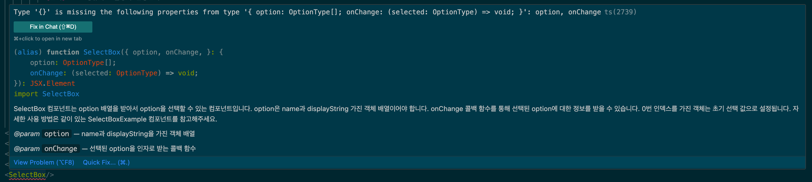

공통으로 사용해야 하는 함수나 컴포넌트라면 JSDoc을 사용하여 다른 동료 분들도 원활하게 사용할 수 있도록 도와주세요.

예시 코드:
``` typescript
type OptionType = {
  name: string
  displayString: string
}

/**
 * SelectBox 컴포넌트는 option 배열을 받아서 option을 선택할 수 있는 컴포넌트입니다.
 * option은 name과 displayString 가진 객체 배열이어야 합니다.
 * onChange 콜백 함수를 통해 선택된 option에 대한 정보를 받을 수 있습니다.
 * 0번 인덱스를 가진 객체는 초기 선택 값으로 설정됩니다.
 * 자세한 사용 방법은 같이 있는 SelectBoxExample 컴포넌트를 참고해주세요.
 * @param option - name과 displayString을 가진 객체 배열
 * @param onChange - 선택된 option을 인자로 받는 콜백 함수
 */

//  상태 관리에 관한 부분은 협의가 필요
export default function SelectBox({
  option,
  onChange,
}: {
  option: OptionType[]
  onChange: (selected: OptionType) => void
}) {
  const [selected, setSelected] = useState(option[0])
```

jsdoc 주석을 작성해 주신다면 다른 동료가 해당 함수에 마우스를 올렸을 때 설명이 뜨게 됩니다.  
