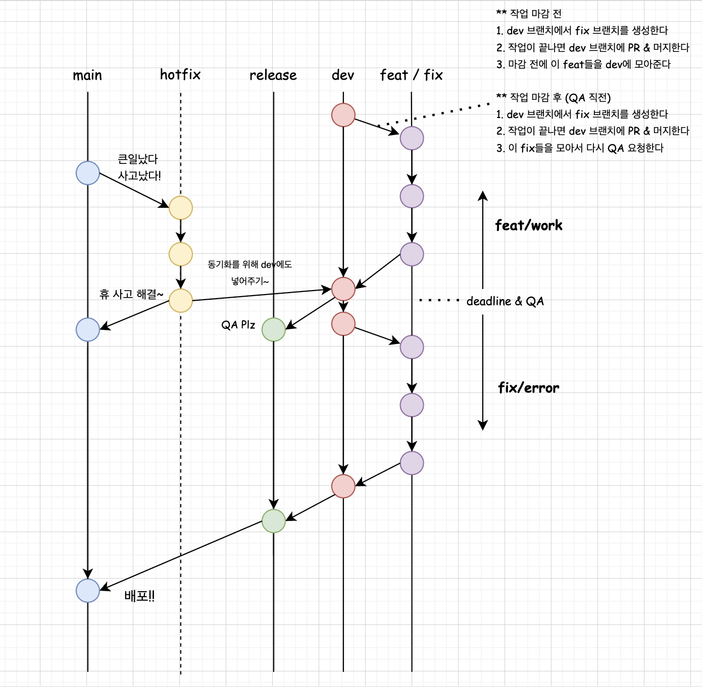

# Git flow

# Git Flow

## 개발 작업 진행 중 (dev <-> feat/fix)
### QA 테스트 전일 경우
1. 작업자는 dev 브랜치에서 feat 브랜치를 생성한다. (ex. feat/referral)
1. 생성 규칙은 'feat/작업이름'이다.
2. 작업자는 feat 브랜치에서 작업이 끝난 후 dev 브랜치에 PR (Pull Request) 를 보낸다.
3. 리뷰가 필요한 경우 리뷰어를 지정해서 리뷰를 받고, 문제가 없을 경우 merge 한다.

### QA 테스트를 할 경우
1. 작업자는 QA 테스터에게 이슈를 할당받는다.
2. 작업자는 해당 이슈를 기준으로 dev 브랜치에서 fix 브랜치를 생성한다.
3. 생성 규칙은 'fix/이슈수정작업이름'이다.
4. 작업자는 이슈를 수정 후 dev 브랜치에 PR & merge 한다.

## QA 테스트 시점 (dev -> release)
1. 프로젝트 관리자는 QA 테스트 직전 dev -> release로 merge 한다.
2. 해당 브랜치 기준으로 QA 서버에 빌드 & QA 테스트를 요청한다.
3. 가령 2025년 7월 18일에 모든 작업을 마감하고 release 브랜치에 merge한다.

## 배포 (release -> main)
1. 프로젝트 관리자는 배포 예정일에 버전을 업한다.
2. 해당 버전으로 main에 merge한다.
3. 해당 버전 기준으로 tag를 생성한다.
4. 해당 버전 기준으로 운영 서버에 build한다.
5. 가령 2025년 7월 29일에 release -> main으로 merge & build한다.

## 긴급 배포 (main -> hotfix)
1. 운영팀 등에서 이슈를 할당받는다.
2. main 브랜치에서 hotfix 브랜치를 생성한다.
3. 생성 규칙은 'hotfix/작업이름'이다.
4. 작업을 완료 후 해당 브랜치를 dev 브랜치에 merge & build 후 긴급 QA 요청을 한다.
5. QA 완료 후 이상 없으면 main 브랜치에 merge & build 후 운영 배포한다.

## 브랜치 규칙

### main
+ main 브랜치로의 머지는 무조건 리뷰어의 승인을 거쳐야 합니다. (리뷰 프로세스 논의 필요)

### dev
+ 현재는 빠른 개발을 목표로 하고 있기 때문에 dev 브랜치로의 MR은 리뷰어의 승인을 거치지 않습니다. (이후 수정 예정)

### feat/fix
+ feat/fix 브랜치는 최신의 dev 브랜치에서 생성해 주세요.
+ git 관리 소프트웨어에서 폴더 형식으로 분류될 수 있도록 브랜치 이름 뒤에 '/'를 붙여주세요.(예: feat/)
+ 컨플릭은 gitlab에서도 해결할 수 있지만 MR 생성 전 dev를 머지 받아서 해결하셔도 됩니다.

## squash 병합
+ 기능별로 커밋 기록을 압축하기 위에 머지를 진행하실 때에는 squash 병합을 이용해 주세요.[링크](GitLab 사용 방법)