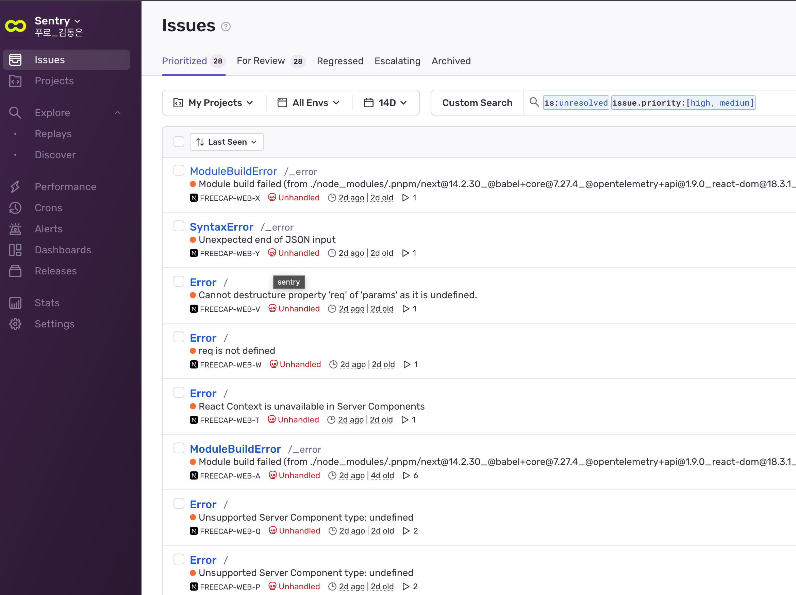
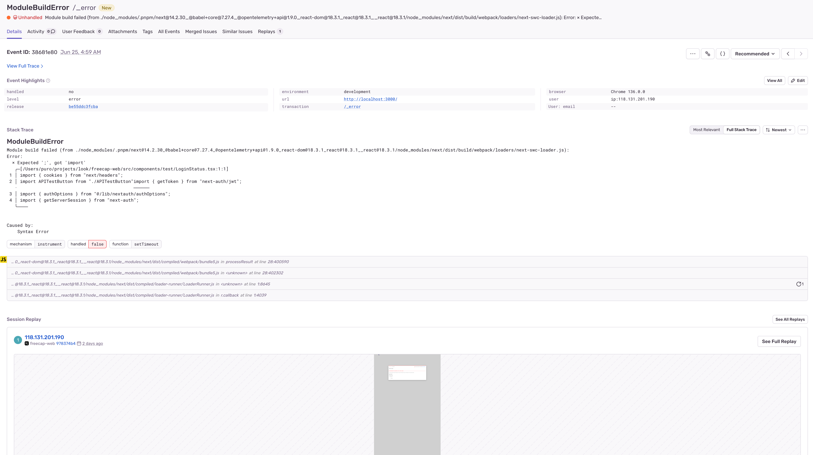
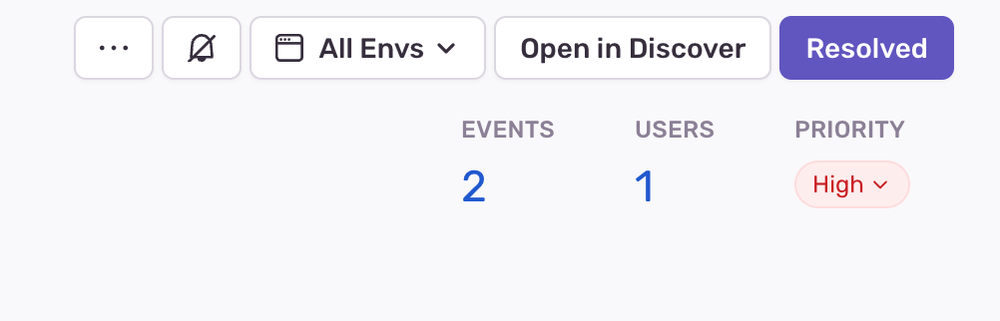
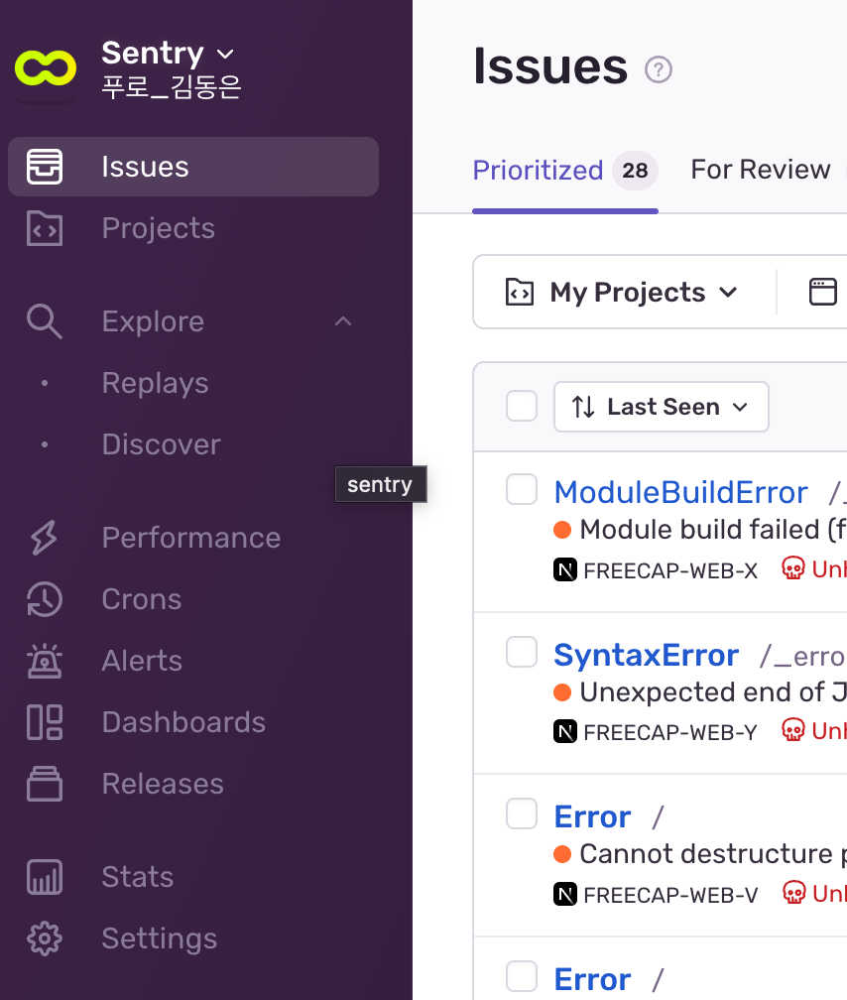
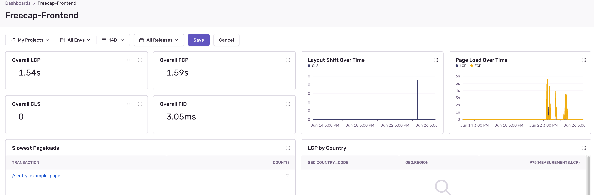
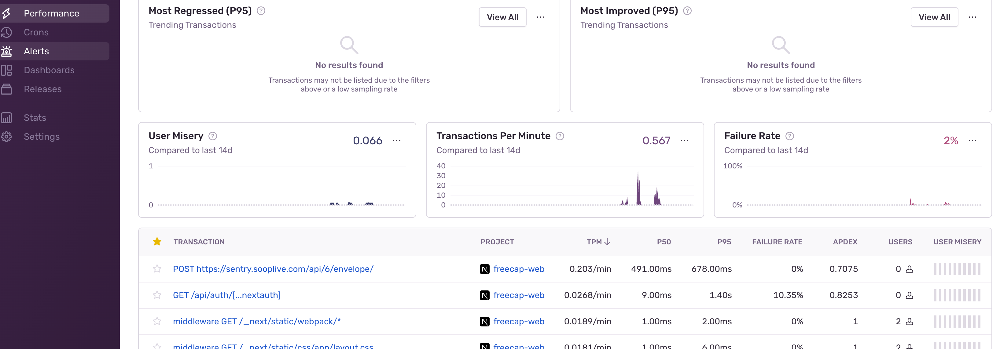

오류 모니터링을 위해 Sentry를 사용하고 있습니다.  
주소: [https://sentry.sooplive.com/](https://sentry.sooplive.com/)

개인 팀을 제외한 팀 생성에는 관리자 권한이 필요합니다.  
현재는 Team이 생성되어 있지 않기 때문에 프론트엔드 오류 로그 확인을 하고 싶으시다면 team-puro로 join 신청 해주시면 됩니다.  
백엔드에서 테스트를 해보고 싶으시다면 팀을 하나 새로 생성 해주셔야 합니다.  
추후 팀 생성 요청을 드리고 관리할 예정입니다.

팀에 가입하셨다면 Issues 탭에서 발생하고 있는 모든 이슈 확인이 가능합니다.  
  
이슈 제목을 클릭하시면 오류 당시 상황의 리플레이와 함께 자세한 정보 확인이 가능합니다.  

해결된 이슈라면 우측 상단에서 Resolved를 눌러주세요.  
  
Dashboards 탭에서 Freecap-Frontend를 누르시면 프론트엔드 대시보드 확인이 가능합니다.  

Performance 탭에서는 요청에 대한 성능을 확인할 수 있습니다.  
특정 요청에서 비정상적인 지연이 발생한다면 함께 논의가 필요합니다.  
